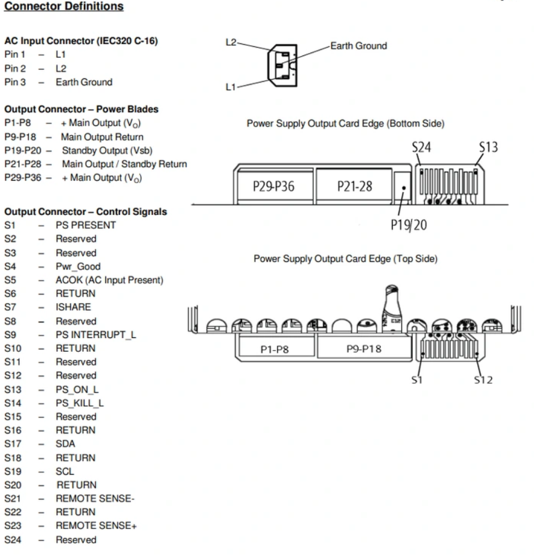

# Dell PSU Monitor

An ESP32-based monitor and controller for Dell server power supplies (PMBus-compatible), with a live web dashboard, OLED status display, Home Assistant integration via MQTT, and OTA firmware updates.

## Features

- **PMBus telemetry** over I2C — input/output voltage, current, power, PFC capacitor voltage, three temperature sensors, fan RPM, and PSU fault/status word
- **Live web dashboard** — single-page UI served directly from the ESP32, updated in real time over Server-Sent Events (no polling, no external dependencies)
- **PSU power control** — toggle PSU output via the web UI, a physical button, or Home Assistant, with debounced input handling
- **Home Assistant integration** — auto-discovery over MQTT publishes sensors (voltage, current, power, temps, fan, status) and a power switch with no manual YAML config
- **OLED status display** — SH1106 128x64 I2C screen showing load, input, temperatures, fan speed, and network info at a glance
- **OTA updates** — flash new firmware over WiFi via `ArduinoOTA`, with progress shown on the OLED
- **AC OK / Power Good monitoring** — reads the PSU's hardware status pins directly for fast fault detection
- **Load vs. system draw separation** — subtracts the monitoring electronics' own current/power draw to report actual downstream load accurately

## Hardware

- ESP32 dev board
- Dell server PSU with PMBus interface (I2C, address `0x58`)
- SH1106 128x64 I2C OLED display (address `0x3C`)
- Transistor/relay driver on the `PS_ON` line for power control
- Physical pushbutton (active-low, internal pull-up)
- AC_OK and PWR_GOOD signal lines wired to GPIO

| Signal | GPIO |
|---|---|
| I2C SDA / SCL | 21 / 22 |
| PS_ON (PSU enable) | 23 |
| PS_PRESENT | 5 |
| Button | 13 |
| AC_OK | 19 |
| PWR_GOOD | 18 |

## Setup

1. Open `Dell_PSU_Monitor.ino` in the Arduino IDE (or PlatformIO) with the ESP32 board package installed.
2. Install the required libraries: `ESPAsyncWebServer`, `U8g2lib`, `ArduinoOTA`, `PubSubClient`.
3. Fill in your own values at the top of the sketch:
   - `ssid` / `password` — your WiFi credentials
   - `otaPassword` — change before deploying
   - `mqttServer` / `mqttUser` / `mqttPass` — your MQTT broker, if using Home Assistant
4. Adjust `SYSTEM_CURRENT_DRAW` / `SYSTEM_POWER_DRAW` to match your own monitoring circuit's power consumption, if you want accurate "load" figures separate from total PSU output.
5. Flash to the ESP32. On boot it connects to WiFi (falling back to a `Dell_PSU_Monitor` AP at `192.168.4.1` if it can't connect) and starts serving the dashboard on port 80.

## Notes

This sketch hardcodes credentials as placeholders — replace them with your own before flashing, and don't commit real secrets if you fork this.
